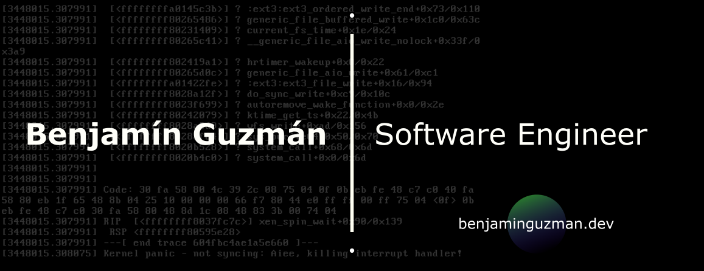

<h2 align="center">👋 I'm Benjamín Guzmán</h2>

<a href="https://benjaminguzman.dev">benjaminguzman.dev</a>

bg@bguzman.dev

<a href="https://medium.com/@GuzmanBenjamin">Blog</a>

### I'm an embedded software engineer and lifelong learner

Proficient in C/C++, cross-compilation, system internals and Linux. 

Passionate about embedded systems, Linux and cybersecurity to build highly reliable software.

I'm more of a **tool-agnostic problem solver** than a framework implementer or coder    

[//]: # (### I'm currently...)

[//]: # (- 👊 working at [KOBD]&#40;https://github.com/KO-Boxing-Data&#41;. [Mau Montaño]&#40;https://github.com/MauSwoosh&#41; and I are the founders.)
[//]: # (- 🦾 studying bionics.)

[//]: # (- 💼 learning about business management.)

[//]: # (-  learning Go)

## Languages and Tools

 

 

 
 

<!-- ) -->

<!--

-->

<!--

-->

## Social media

<!-- Medium -->

<!-- LinkedIn -->

<!-- ORCID -->

<!-- HackerRank -->

<!-- Leetcode -->

<!-- Platzi -->

[//]: # (Thanks for reading till the end, now you can marvel at my sorting algorithm. TODO insert link)
