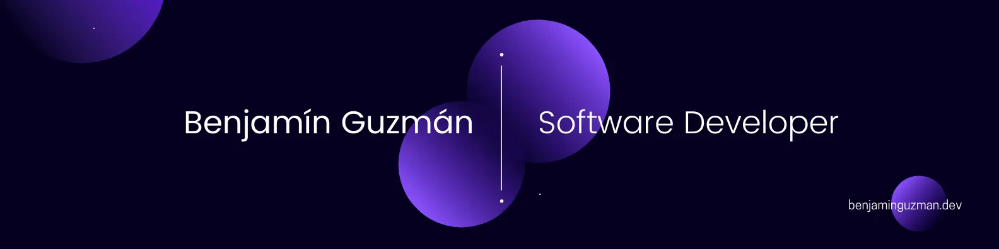

<h2 align="center">👋 I'm Benjamín Guzmán</h2>

<a href="https://benjaminguzman.net">benjaminguzman.net</a>

bg@benjaminguzman.net

### I'm a backend developer, lifelong learner and student

I've worked as fullstack on various projects, but what I like the most is backend. 
However, I'm also interested in security, data science and entrepreneurship.

### I'm currently...

[//]: # (- 👊 working at [KOBD]&#40;https://github.com/KO-Boxing-Data&#41;. [Mau Montaño]&#40;https://github.com/MauSwoosh&#41; and I are the founders.)
- 🧬 studying bionics.

- 💼 learning about business management.

-  learning Go

## Languages and Tools

 

 
 

 
 

<!-- ) -->

## Social media

<!-- HackerRank -->

<!-- Platzi -->

<!-- Medium -->

<!-- LinkedIn -->

